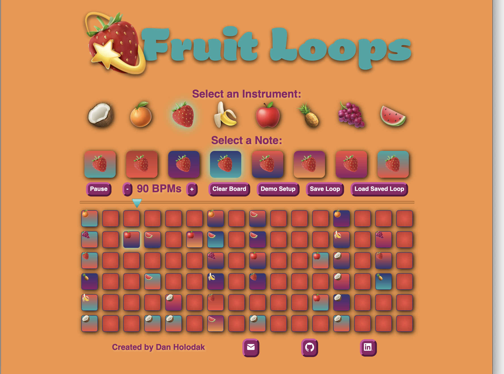
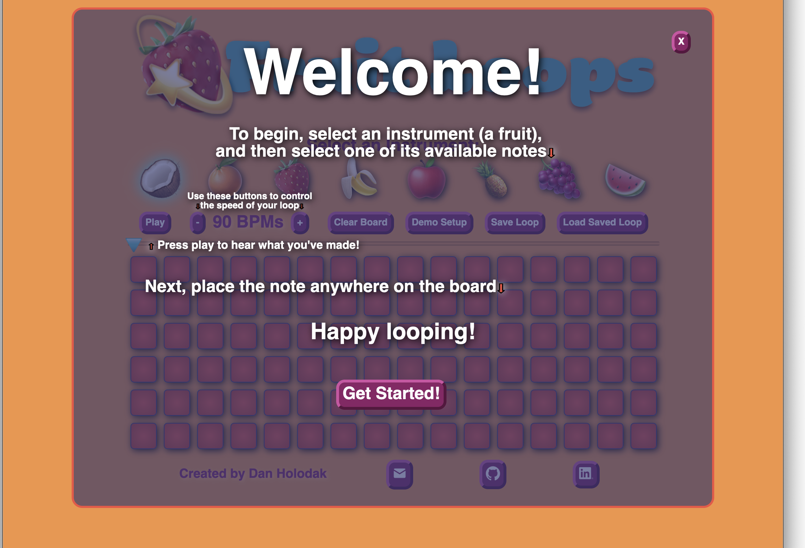

# Fruit Loops
## Url: https://danholodak.github.io/Fruit-Loops/

## Description:
Fruit Loops is a browser based demo based on the functionality of a drum pad or sequencer. 
It allows users to make a simple bit of music that can loop infinitely.

## Functionality:
All the functionality is controlled by clicking different page elements.
Users are able to:
 
    • Select an instrument (fruit) and, once selected, the instrument's available sounds, or notes, will appear.
    • (Once the user also selects a note) Choose a tile (or tiles) on the loop board to fill with the selected sound.
    • Remove a sound from the board by clicking the tile again.
    • Play or Pause the loop playing-through all the sounds placed on the board.
    • Change the tempo (the BPMs) of their loop.
    • Save a loop, (with the save button) so they can return to the same board-state later (with the load button). 
    • Load a demo board setup, to see an example of what can be made.


In addition, this project includes:
    
    • Instructions that guide a user on how to interact with the page.
    • Hover effects to suggest clickable items.



    • When a user opens the page, instructions overlay the UI with a transparency, so they can point to specific page elements.
    

## Technical Details:
This project is written using vanilla Javascript/ HTML / CSS. The animation is achieved using DOM manipulation in Javascipt.

## Mockup:


Above is my original mockup, showing my decisionmaking for the general layout of the UI.
### And my notes about functionality:

    • fruits on the top represent instruments
    • colored tiles below represent notes and will appear/disappear as you select a fruit
    • the playhead below that will scroll across as the loop is played
    • the empty sqaures below that are where the user will place tiles to add them to the sequence.
    • (in this example the user has placed the "blue" note of the "orange" instrument in various spots)


## But how does it all work?

### The logic behind selecting a note is pretty simple:
```javascript
handleClick(){
        this.audio.play()
        let selectedNote = document.querySelector("ul.notes li.selected")
        if (selectedNote){
            selectedNote.classList.remove('selected');
        }
        this.element.classList.add('selected');
        this.selected = !this.selected;
    }
```
• The function, first, plays the note's associated audio file, then checks for a previously selected note and removes the 'selected' class from that, then adds the 'selected' class to the newly-clicked note.

### This is how a user can populate a space on the board:

```javascript
    clickHandler(){
        if (!this.element.classList.contains('empty')){
            this.audio = null;
            this.element.classList = ["empty tile"];
            this.element.innerText = "";
        }else{
            let selectedSound = document.querySelector("ul.notes li.selected")
            if (selectedSound){
                let selectedNote = selectedSound.classList[0]
                this.element.classList.add(selectedNote);
                this.element.classList.remove("empty");
                this.element.classList.add("active");
                this.element.innerText = selectedSound.innerText;
                let instrument = selectedSound.parentElement.id;
                this.audio = new Audio(`./src/sounds/${instrument}/${selectedNote}.mp3`)
            }
            
        }
    }

```
 • The function grabs information from the note the user has selected and populates the board space with the same information (classes to determine styling, inner text to put the correct emoji, and a file path to connect an audio file). 

 • Or if the space is already populated (does not include the class 'empty') the function will simply clear out all the information.

### The logic behind how the animation and sound happens is a bit more complicated:

```javascript
PPclickHandler(){
        this.playhead = document.querySelector("img.playhead");
        this.playing = !this.playing;
        this.playing? this.PPElement.innerText = 'Pause' : this.PPElement.innerText = 'Play';
        frame = frame.bind(this);
        if (this.playing){
            this.interval = setInterval(frame, this.ms);
        }else{
            clearInterval(this.interval);
        }
        function frame(){
            if (this.pos < 99) {
                this.pos++;
                this.playhead.style.marginLeft = this.pos + "%"; 
                let section = Math.floor(this.pos/6.25);
                this.tileboard.columns[section].tileChildren.forEach(function(child){
                    if (child.audio && !child.played){
                        child.audio.play();
                        child.glow();
                        child.played = true;
                    }
                }) 
                
              } else {
                this.pos = 0;
                for(let i=0; i<this.tileboard.columns.length; i++){
                    this.tileboard.columns[i].tileChildren.forEach(function(child){
                        child.played = false;
                    })
                }
              }
        }
    
    }
```

### The above function implements the main logic of the program. 

• It, first, finds the playhead for future animation, then it  changes the state from not playing to playing or vice versa and updates the button to reflect this.

• Next, if playing, it calls the animation function (frame) and if pausing it stops that same function. 

• The interval(in milliseconds) at which it keeps calling the frame function is determined by an equation that converts beats per minute to milliseconds for each one percent of the playbar crossed (.04/bpms * 60,000 = ms).

• Within the animation function, it changes the position of the playhead in relation to the playbar by 1% of the playbar width. Then it converts this position to the index of one column of tiles by dividing by 6.25 (1/16 of 100%) and rounding down to an integer.

• We then loop through the tiles at that column, if an occupied tile is found that hasn't been played, the audio and glow function is triggered and played state is flipped.

• Lastly, every time the position reaches the end it's reset to zero and the played state of all the tiles is reverted to not played.


## My Implementation timeline:

Friday Afternoon & Weekend:

    • Research how to use audio files with Javascript
    • Research how to make page elements selectable
    • Research animation
    • Collect all sound files needed
    • Get elements placed correctly in UI
    • Make buttons selectable
Monday:

    • Implement animation functionality
    • Implement button selection
    • Implement audio playing
Tuesday:

    • Add glow animation to playing loop
    • Clean up UI
    • Clean up code file and class structure
    • Add labels for instruments and opening user-instructions.

Wednesday:

    • Add bonus functionality of saving a loop and loading a demo loop.
    • Optimize audio-playing logic.
    • Add credits and link buttons on the bottom.

Thursday Morning:

    • Finish Production Readme


## Future functionality to implement:

    • User can download their loop as a single mp3 file
    • User can share their loop with friends
    • User can add custom emoji-instruments with uploaded sound files.
    • User can change their loop length to multiple measures

## To download and run this locally:

    • clone the repo or download zip
    • cd into the folder and run command `bundle install` in terminal
    • then run command `npm run watch` for dev environment or `npm start` for production
    • open index.html file in a web browser

